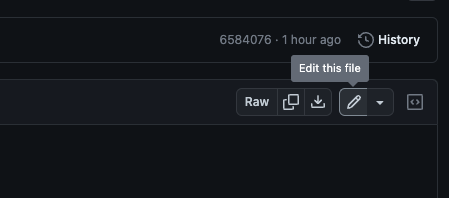
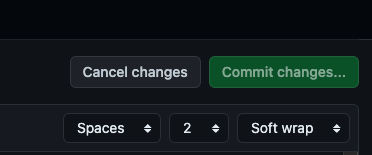
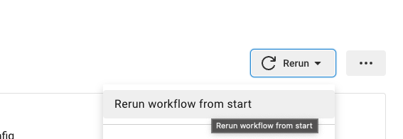
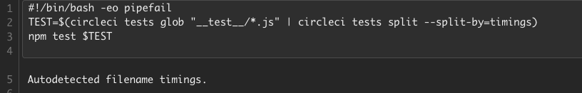

# CircleCI Teachback

This repo will be used for TSM's to practice implementing CircleCI features on a basic Node application. We will meet as a group and have the TSMs explain how they implemented these features. Feel free to reach out to Tanner with questions! 

## Objectives

The objective of this activity is to have TSMs practice implementing the following:

- Test splitting 
- Uploading test results 

## About this Repo

**Branch**

- 0: This is the starter branch with a basic build and test workflow. Fork this branch to your own GitHub account. You can create a new branch to make your edits. You only need to work through the GitHub UI. 

    
Expand to view a description of files in this repo

Inside this repo are several directories and files. Below is a quick explaination of what they are. You will only make edits to the `.circleci/config.yml` file, however.  

- __test__ : this directory contains the test files. You will need to point CircleCI to this directory when test splitting.

- node_modules: contains all node modules needed to run this application

- public: this directory contains the website page files

- app.js: this JavaScript contains the code to navigate the website

- package.json: contains required packages for the app

- server.js: this JavaScript runs the application

## Prerequisites

1. [Fork](https://github.com/tannerwride/express-app-teachback/fork) this repository to your personal GitHub account. 
2. [Setup the CircleCI project](https://circleci.com/docs/getting-started/?utm_source=google&utm_medium=sem&utm_campaign=sem-google-dg--uscan-en-dsa-tROAS-auth-brand&utm_term=g_-_c__dsa_&utm_content=&gclid=Cj0KCQjwtO-kBhDIARIsAL6LoreqoxYV4ckTzv020rOwBBsWl2nJ5QQsMQeJ6YMxhaJJgzqd4hp9hCgaAnrNEALw_wcB) in your account
    - Point to the branch titled `0` for the config file

## Instructions
The premise of this activity is that you have created a basic Node.js application and have a workflow on CircleCI that builds, tests, and deploys that application. The platform team you are a part of wants to implement a few CircleCI features to improve the CI/CD pipeline. Your job is to add contexts to the project to keep the organizations secrets safe, add test splitting to improve workflow run time, and store test results to detect any flaky tests and make improvements over time. 

To make edits to the config file, open the `config.yml` file in your forked GitHub repo and click the edit button.

When finished editing, click commit changes. GitHub may ask for a commit message, you can modify this if you want, or leave it as is. 

### Implement Test Splitting 

You've been tasked with implementing the test splitting feature on the job "build_and_test". For this activity, simply make edits in the GitHub UI by opening the config file found in the `.circleci` directory. 

Here are some tips to help you along:

- CircleCI needs to know how many [parallel machines](https://circleci.com/docs/parallelism-faster-jobs/#specify-a-jobs-parallelism-level) to use to distribute tests across.
- CircleCI needs to know what files contain your tests.
- CircleCI needs to know how to split the tests, by filename, filesize, or timing data.

Start by splitting by filename. 

**Hint**: Pointing to test files and specifying a test split type (filename, filesize, timing) both happen by typing a [CLI command](https://circleci.com/docs/use-the-circleci-cli-to-split-tests/) in the config file. [This tutorial will help you impliment test splitting](https://circleci.com/docs/test-splitting-tutorial/) 

### Upload Test Results 

Now that you've implemented test splitting (congrats!), the team would like to start splitting by timing data. Only one problem. We don't have any timing data to split tests by! 

Your next task is to upload test results to CircleCI so we can split by those test results. Luckily, the test results are already being saved in a temporary folder in our environment when a job is run. This file is called `junit.xml`. Use the `save_test_results` command in the `build_and_test` job to point to this file. 

Commit the change in GitHub. 

If successful you should see something like this on the job in the UI:

### Split Tests by Timing

Update the test command in the `config.yml` file to split by timing data. Remember, you define the test splitting method using the CLI command adding `split-by=timings`. Commit the config to run a new build. Once the build has completed, rerun the workflow. 

After the workflow completes, open the job and expand the step where tests are run. You will know it was successful if you see the following:

`Autodetected filename timings` means CircleCI successfully found timing information to split the tests by. 

## Conclusion

Great work! Be prepared to discuss your experience implementing test splitting with the team. You will be asked to explain to the group how to implement these features. 

